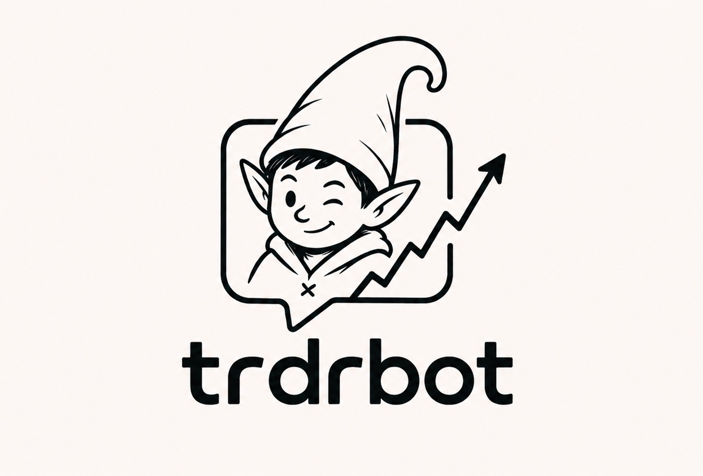

# Theo Design System

The design system for trdrbot's mascot, Theo — reconciling the elf-mascot logo with the
documentary "ledger" voice already in production across two live artifacts (Theo's Book, a
plain-English glossary; Theo's Ledger, a decision-transparency report). This document is the
content/rationale spec; a fully-styled interactive HTML version lives alongside it at
`docs/design_system.html`.

## The mark

**Description, for reference without the image:** a monoline, hand-drawn-style illustration of a
winking elf character — pointed ears, a tall curled elf hat, a hoodie with a small "x" stitch
detail — framed inside a rounded-square outline shaped like a speech/chat bubble (it has a small
tail, like a message bubble). An ascending, zigzagging arrow (a stock-chart uptrend line) breaks
through and past the right edge of the frame. Below the icon, the wordmark **"trdrbot"** in a
bold, rounded, geometric, lowercase sans-serif. The whole mark is pure black line art (no fills,
no color) on a warm off-white/cream background.

**Sampled directly from the source file** (`docs/assets/trdrbot_logo.jpeg`, 1244×844px):
- Background: `#FCF7F4`
- Line work: `#000000`

These two values are treated as **fixed brand constants** — they do not change with light/dark
theme, the way a printed logo has one true presentation regardless of what page it sits on.

### Usage rules

**Do:**
- Place on a plain, light ground — its native cream, or white.
- Scale proportionally, always.
- Give it clear space on all sides at least equal to the x-height of the wordmark before any
  other content begins.

**Don't:**
- Recolor the line work. It is black; it stays black.
- Stretch, skew, or place on a busy photo/pattern background.
- Add a drop shadow, outline, or glow — the line art carries itself.

**Minimum size:** 32px digital / 12mm print. Below that, drop the wordmark and use an icon-only
crop of the mark (the top portion, elf + bubble frame, without the wordmark).

**Asset status:** only one source file exists today — a single flattened JPEG. Everything above
is usage guidance built from that one asset. An icon-only crop is achievable by cropping the same
file, but is not yet a separate approved asset; treat it as a reference crop, not an official
export, until a vector (SVG) or layered source exists.

## Rationale: two registers, one brand

Theo has always had two jobs pulling in different directions, and the mark makes that literal: a
warm, hand-drawn, winking, monochrome mascot carrying a precise, ruthless internal ledger. Rather
than picking one visual language and discarding the other, this system names both as deliberate,
coordinated **registers**:

| | Brand register | Ledger register |
|---|---|---|
| **Mood** | Warm, approachable, a little mischievous | Cool, precise, documentary |
| **Ground** | The mark's native cream (`#FCF7F4`), fixed, never re-themed | Sage-tinted paper, full light/dark support |
| **Display type** | Fredoka (rounded, geometric) | Fraunces (literary serif) |
| **Used for** | Website marketing surfaces, slide decks — anywhere Theo is being *introduced* | Trade blog, position write-ups, reports — anywhere Theo is being *audited* |
| **Radius language** | Rounded-square (14–22px), borrowed directly from the mark's own speech-bubble frame | Sharp (4px) — precision reads through the edges |
| **Proven in** | This system (new) | Theo's Book, Theo's Ledger (already live) |

The mark itself carries **no color** — it's pure monochrome line art — which is why the single
accent color below is described as "the one place Theo's color lives": nothing in the logo needed
reconciling with it.

## Color tokens

### Brand constants (fixed, not theme-aware)

| token | value | use |
|---|---|---|
| `--brand-paper` | `#FCF7F4` | the mark's native ground |
| `--brand-ink` | `#000000` | the mark's line weight |

### Ledger palette (light / dark)

| token | light | dark | use |
|---|---|---|---|
| `--paper` | `#F1F4EF` | `#101816` | page ground |
| `--paper-raised` | `#FFFFFF` | `#172220` | cards, tables |
| `--paper-line` | `#D8E0D9` | `#293530` | hairline rules |
| `--ink` | `#17242B` | `#E8EEEA` | body text |
| `--ink-soft` | `#4B5D59` | `#9FB0AA` | secondary text |
| `--ink-faint` | `#7C8C87` | `#6E7F79` | meta, captions |
| `--accent` | `#1F6F5C` | `#57C7A7` | the one signature color — used across both registers |
| `--accent-soft` | `#E4EFEA` | `#17332B` | accent tints, callout backgrounds |
| `--danger` | `#B23A2E` | `#E5786A` | critical states only — never decorative |
| `--danger-soft` | `#F7E6E3` | `#3A2321` | danger tints |
| `--caution` | `#8A6A16` | `#E0BB5C` | warnings, rejected states |
| `--caution-soft` | `#F3ECD3` | `#332C16` | caution tints |

**Rule:** semantic color (accent/danger/caution) is never the only signal carrying meaning — every
use pairs with a label, icon, or text. Color reinforces; it doesn't carry meaning alone.

## Typography

Four faces, four distinct jobs — chosen for what each question is, not for variety:

| face | weights | role | answers |
|---|---|---|---|
| **Fredoka** | 500, 600, 700 | Brand display | What is this mark saying? (marketing headlines, slide titles, nav wordmark) |
| **Fraunces** | 440–650, optical size 9–144 | Editorial display | What is this document arguing? (report/document headings) |
| **Public Sans** | 400–700 | Body / UI | What is this interface asking you to do? (paragraphs, buttons, forms, nav) — the workhorse; default when in doubt |
| **IBM Plex Mono** | 400, 500 | Data | What is this number? (tickers, timestamps, IDs, code, badges — anywhere alignment matters) |

All four load from Google Fonts. Fredoka is never used for body copy; Fraunces is never used for
UI chrome; Public Sans and Plex Mono are shared across both registers.

### Editorial type scale

| level | size | example |
|---|---|---|
| h1 | 2.6rem | "Reading the ledger" |
| h2 | 1.55rem | "The three trades" |
| h3 | 1.1rem | "Entry reasoning" |
| body | 1rem, Public Sans 400 | running prose |
| mono / meta | 0.82rem, Plex Mono 400 | `jrn_20260828T173417Z_exe22d7fb` |

## Voice guide — which face, where

One table settling every "which font" question:

| surface | display face | register |
|---|---|---|
| Website hero / nav | Fredoka | Brand |
| Slide deck titles | Fredoka | Brand |
| Social / launch graphics | Fredoka | Brand |
| Trade blog, position write-ups | Fraunces | Ledger |
| Docs, reports | Fraunces | Ledger |
| App UI, forms, buttons | Public Sans | Either |
| Tickers, timestamps, code, IDs | IBM Plex Mono | Either |

## Spacing, radius, elevation

An 8px grid throughout. Radius is deliberate, not uniform — sharp for documents (the ledger
register reads as precise because its edges are), rounded-square for brand surfaces (borrowed
directly from the mark's own frame, not a default choice).

| token | value | use |
|---|---|---|
| `--space-1` | 4px | tight inline gaps |
| `--space-2` | 8px | base unit |
| `--space-3` | 16px | component padding |
| `--space-4` | 24px | card padding |
| `--space-6` | 48px | section rhythm |
| `--radius-doc` | 4px | ledger cards, tables, callouts |
| `--radius-pill` | 999px | badges, buttons |
| `--radius-brand` | 14–22px | brand surfaces — the mark's own frame radius |
| `--shadow` | `rgba(23,36,43,0.10)` (light) / `rgba(0,0,0,0.4)` (dark) | used once, on raised brand cards only — the ledger register stays flat |

## Components

Already live in production (Theo's Ledger, Theo's Book) — collected here as shared vocabulary:

- **Buttons** — primary (filled accent) and ghost (accent outline), Public Sans 600, `--radius-pill`
- **Status pills** — `traded` (accent), `declined` (neutral), `rejected` (caution), `gap` (danger);
  each a small filled dot + Plex Mono uppercase label
- **Stat tile** — large Plex Mono tabular number + small label underneath, used for scoreboard-style
  summaries (e.g. "101 theses pre-registered")
- **Mono chip** — inline background-tinted `--paper-line` chip for a ticker/ID/timestamp inside a
  sentence
- **Callout** — accent-tinted background, left accent border, small uppercase label (e.g.
  "factual note") above the body text — used to flag honest gaps or asides without breaking flow

## Applied examples

Three surfaces the system was checked against to confirm it holds together:

1. **Website hero** (brand register): cream background, Fredoka headline ("Theo learns why it was
   right."), Public Sans subhead, rounded-square card frame.
2. **16:9 slide title** (brand register): same cream ground, small Plex Mono eyebrow line, Fredoka
   title, Public Sans subtitle, the mark placed small in the corner.
3. **Document card** (ledger register): white card on sage paper, Plex Mono eyebrow naming the
   source document ("Theo's Ledger"), Fraunces heading, Public Sans body quoting real trade
   reasoning, a Plex Mono source-path footer.

## Provenance

- Logo source: `docs/assets/trdrbot_logo.jpeg` (user-supplied, 2026-08-26), 1244×844px JPEG.
- Brand colors sampled programmatically from that file (Pillow pixel sampling), not eyeballed.
- Ledger palette and component vocabulary carried forward unchanged from two prior live
  documents: **Theo's Book** (a novice-investor glossary) and **Theo's Ledger** (a verbatim
  decision-transparency report of trdrbot's real trades).
- Fonts: Fraunces, Fredoka, Public Sans, IBM Plex Mono — all Google Fonts, loaded via a single
  stylesheet link.
